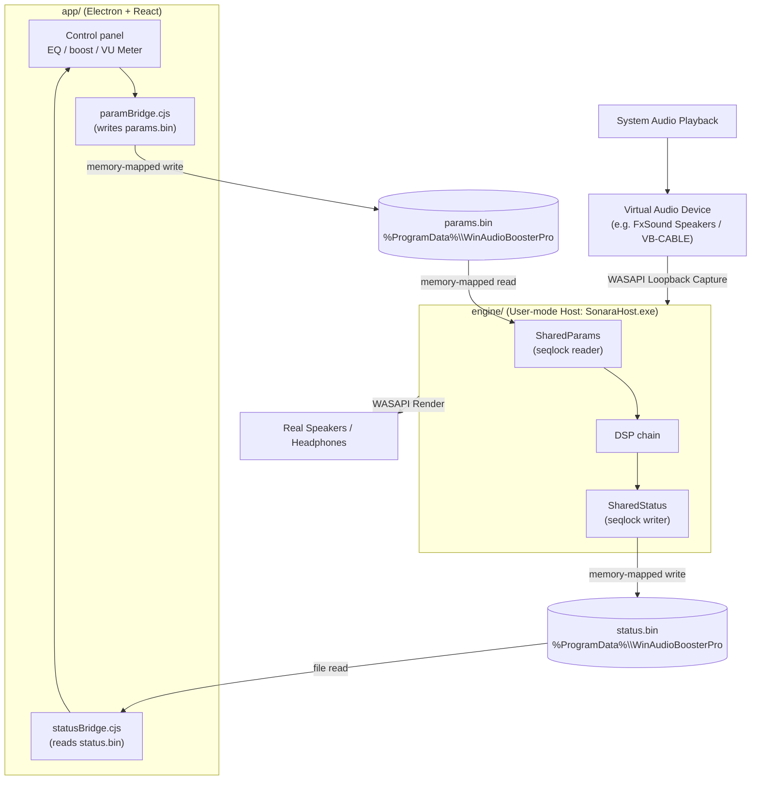

# Architecture

Sonara is split into two independent halves that share nothing but a tiny binary
parameter file. This keeps the real-time audio code small and dependency-free,
and lets the UI be a normal desktop app.



## 1. The DSP core (`engine/src/dsp/`)

Header-only, portable C++20 with **no OS or Windows dependency**, so it compiles
and is unit-tested on Linux CI. Signal flow inside `BoostEngine`:

```
input → preamp → 10-band EQ → bass → clarity → [soft pre-clip] → compressor → stereo widen (w/ mono compatibility) → output gain → limiter → output
```

| File | Responsibility |
|------|----------------|
| `Biquad.h` | RBJ biquad filters (peaking, shelves, high/low-pass). |
| `Parameters.h` | Plain parameter struct + units shared with the UI. |
| `Compressor.h` | Soft-knee dynamics for loudness/"dynamic". |
| `Limiter.h` | Look-ahead brick-wall limiter (prevents clipping on big boosts). |
| `StereoEnhancer.h` | Mid/side width + ambience (with automatic mono-compatibility correlation protection). |
| `BoostEngine.h` | Orchestrates the full chain (including tanh soft pre-clipper for gain staging protection). |

Because it is pure and allocation-free on the audio path, the same core can be
reused later for a microphone engine or a macOS port.

## 2. The Windows User-Mode Host & Legacy APO Shell (`engine/src/host/` & `engine/src/apo/`)

In the user-mode VAD architecture, instead of injecting an APO DLL directly into the protected `audiodg.exe` system process, we run a user-mode host (`SonaraHost.exe`) that handles the loopback-to-render pipeline.

| File / Component | Responsibility |
|------|----------------|
| `src/host/main.cpp` | The user-mode host entry point. Performs WASAPI Loopback capture from the virtual playback device (e.g. FxSound Speakers or VB-CABLE), processes the buffer with `BoostEngine` in-place, and renders to the real physical device (e.g. Speakers). |
| `src/apo/SharedParams.h` | Maps `params.bin` and reads parameters with a seqlock (RT-thread safe, pinned memory via `VirtualLock`, no page faults). |
| `src/apo/SharedStatus.h` | Maps `status.bin` and writes heartbeat + audio levels with a seqlock (RT-thread safe, pinned memory). |
| `src/apo/StatusBlock.h` | Defines the binary POD structure for the heartbeat/RMS status bridge. |
| `src/apo/BoosterAPO.{h,cpp}` | (Legacy Reference) The system effect APO implementation, retained for reference or alternative setups. |

## 3. The parameter and status bridges (Bi-directional IPC)

The UI never talks to the audio processing thread directly, ensuring a crash or hang in the UI cannot stall the physical audio stream. Communication is completely bi-directional via memory-mapped files:

- **Parameter Bridge (UI → Host):**
  - **File:** `C:\ProgramData\WinAudioBoosterPro\params.bin`
  - **Concurrency:** A sequence counter (seqlock) lets the reader detect torn writes and skip them. It uses `YieldProcessor()` rather than `Sleep(0)` in its retry spinloop to be completely real-time safe.
  - **Layout:** Magic `WABP`, version, sequence counter, enabled flag, preampDb, outputGainDb, the 10-band EQ gains, and the enhancer and limiter settings. Pinned via `VirtualLock` to avoid soft page faults on the RT audio thread.
  - **Path:** `app/electron/paramBridge.cjs` (writer) and `engine/src/apo/SharedParams.h` (reader, utilized by `SonaraHost.exe`).

- **Status Bridge (Host → UI):**
  - **File:** `C:\ProgramData\WinAudioBoosterPro\status.bin`
  - **Concurrency:** A seqlock-protected writer avoids torn writes. The host writes processing stats and heartbeat every ~100ms.
  - **Layout:** Magic `WABS`, sequence counter, heartbeat tick, RMS levels (L/R), Peak levels (L/R), sample rate, and channels. Pinned via `VirtualLock` to guarantee RT-thread safety.
  - **Path:** `engine/src/apo/SharedStatus.h` / `StatusBlock.h` (writer, utilized by `SonaraHost.exe`) and `app/electron/statusBridge.cjs` (reader). Used to verify the host is actually running and drive the live VU meter in the UI.

## 4. The desktop app (`app/`)

- `electron/main.cjs` — window/tray lifecycle, global hotkeys, status polling, and elevated engine management.
- `electron/paramBridge.cjs` — serializes UI state into `params.bin`.
- `electron/statusBridge.cjs` — parses `status.bin` to check heartbeat freshness and expose RMS/peak levels.
- `electron/licensing.cjs` — offline Ed25519 license verification + trial; the `LAUNCH_FREE` flag unlocks everything.
- `electron/preload.cjs` — safe IPC surface exposed to the renderer (including audio levels events).
- `src/` — React control panel (presets, EQ sliders, enhancers, VU meter, i18n EN/AR).

### Renderer structure (`app/src/`)

The UI follows a single-responsibility layout: `App.tsx` is a thin orchestrator
that owns state and effects, while data, side-effects, and presentation each
live in their own module.

```
src/
├─ App.tsx            # orchestrator: wires state, effects, and components
├─ i18n.ts            # EN/AR strings + `Strings`/`Lang` types
├─ presets.ts         # `Preset` type + built-in DEFAULTS
├─ audio.ts           # pure unit helpers (posToDb, norm) + EQ band labels
├─ global.d.ts        # window.api typings (IPC contract with preload)
├─ hooks/
│  ├─ useEngine.ts        # native engine status + license via IPC events
│  ├─ useLocalStorage.ts  # generic typed localStorage-backed state
│  └─ usePresets.ts       # custom presets CRUD + selection (persisted)
└─ components/
   ├─ Header.tsx         # brand, license pill, power, settings menu
   ├─ EngineBar.tsx      # engine install status + install button
   ├─ TopBar.tsx         # preset selector + device label + visualizer
   ├─ Visualizer.tsx     # animated level bars
   ├─ ControlSidebar.tsx # boost + bass/clarity/dynamic/surround/ambience
   ├─ Equalizer.tsx      # 10-band graphic EQ
   └─ Modals.tsx         # save / delete / license dialogs
```

Design rules:

- **Pure helpers (`audio.ts`, `presets.ts`) have no React dependency**, so they
  can be unit-tested or reused outside the renderer.
- **Hooks own side-effects.** `useEngine` is the only place that subscribes to
  IPC events; `usePresets`/`useLocalStorage` are the only places that touch
  `localStorage`. Components never reach for `window.api` or storage directly.
- **Components are presentational** — they receive data and callbacks as props
  and hold no business logic. The preset ↔ live-audio-state mapping stays in
  `App.tsx`, which owns that state.

## Why this split

- The audio-thread code stays tiny, portable, and testable.
- The UI can use the full Electron/React stack without touching real-time code.
- A crash or hang in the UI cannot stall the audio engine.
