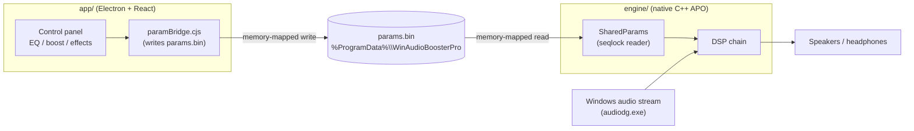

# Architecture

Sonara is split into two independent halves that share nothing but a tiny binary
parameter file. This keeps the real-time audio code small and dependency-free,
and lets the UI be a normal desktop app.



## 1. The DSP core (`engine/src/dsp/`)

Header-only, portable C++20 with **no OS or Windows dependency**, so it compiles
and is unit-tested on Linux CI. Signal flow inside `BoostEngine`:

```
input → preamp → 10-band EQ → bass → clarity → compressor → stereo widen → output gain → limiter → output
```

| File | Responsibility |
|------|----------------|
| `Biquad.h` | RBJ biquad filters (peaking, shelves, high/low-pass). |
| `Parameters.h` | Plain parameter struct + units shared with the UI. |
| `Compressor.h` | Soft-knee dynamics for loudness/"dynamic". |
| `Limiter.h` | Look-ahead brick-wall limiter (prevents clipping on big boosts). |
| `StereoEnhancer.h` | Mid/side width + ambience. |
| `BoostEngine.h` | Orchestrates the full chain; the only header the host includes. |

Because it is pure and allocation-free on the audio path, the same core can be
reused later for a microphone engine or a macOS port.

## 2. The Windows APO shell (`engine/src/apo/`)

Wraps the DSP core in the COM/APO interfaces Windows requires to insert an
effect into the system audio graph.

| File | Responsibility |
|------|----------------|
| `BoosterAPO.{h,cpp}` | `IAudioProcessingObject` implementation; calls `BoostEngine` per buffer. |
| `ClassFactory.{h,cpp}` | COM class factory for the APO CLSID. |
| `SharedParams.h` | Maps `params.bin` and reads parameters with a seqlock (lock-free, audio-thread safe). |
| `../dllmain.cpp` | `DllGetClassObject` / `DllRegisterServer`: registers the COM server **and** the APO. |
| `../BoosterAPO.def` | Exported COM entry points. |

## 3. The parameter bridge

The UI never talks to the audio thread directly. It writes a fixed-layout binary
block to a memory-mapped file; the APO reads it every buffer.

- **File:** `C:\ProgramData\WinAudioBoosterPro\params.bin`
- **Concurrency:** a sequence counter (seqlock) lets the reader detect torn
  writes and skip them — no locks on the audio thread.
- **Layout:** magic `WABP`, version, seq, then enabled flag, gains, the 10 EQ
  band gains, the five enhancer amounts, and limiter settings. The exact byte
  layout lives in `app/electron/paramBridge.cjs` (writer) and
  `engine/src/apo/SharedParams.h` (reader) and must stay in sync.

## 4. The desktop app (`app/`)

- `electron/main.cjs` — window/tray lifecycle, global hotkeys, and one-time
  engine install (runs the PowerShell scripts elevated). It contains **no**
  Equalizer APO logic; it only drives our own engine.
- `electron/paramBridge.cjs` — serializes UI state into `params.bin`.
- `electron/licensing.cjs` — offline Ed25519 license verification + trial; the
  `LAUNCH_FREE` flag unlocks everything during the free launch phase.
- `electron/preload.cjs` — safe IPC surface exposed to the renderer.
- `src/` — React control panel (presets, EQ sliders, enhancers, i18n EN/AR).

### Renderer structure (`app/src/`)

The UI follows a single-responsibility layout: `App.tsx` is a thin orchestrator
that owns state and effects, while data, side-effects, and presentation each
live in their own module.

```
src/
├─ App.tsx            # orchestrator: wires state, effects, and components
├─ i18n.ts            # EN/AR strings + `Strings`/`Lang` types
├─ presets.ts         # `Preset` type + built-in DEFAULTS
├─ audio.ts           # pure unit helpers (posToDb, norm) + EQ band labels
├─ global.d.ts        # window.api typings (IPC contract with preload)
├─ hooks/
│  ├─ useEngine.ts        # native engine status + license via IPC events
│  ├─ useLocalStorage.ts  # generic typed localStorage-backed state
│  └─ usePresets.ts       # custom presets CRUD + selection (persisted)
└─ components/
   ├─ Header.tsx         # brand, license pill, power, settings menu
   ├─ EngineBar.tsx      # engine install status + install button
   ├─ TopBar.tsx         # preset selector + device label + visualizer
   ├─ Visualizer.tsx     # animated level bars
   ├─ ControlSidebar.tsx # boost + bass/clarity/dynamic/surround/ambience
   ├─ Equalizer.tsx      # 10-band graphic EQ
   └─ Modals.tsx         # save / delete / license dialogs
```

Design rules:

- **Pure helpers (`audio.ts`, `presets.ts`) have no React dependency**, so they
  can be unit-tested or reused outside the renderer.
- **Hooks own side-effects.** `useEngine` is the only place that subscribes to
  IPC events; `usePresets`/`useLocalStorage` are the only places that touch
  `localStorage`. Components never reach for `window.api` or storage directly.
- **Components are presentational** — they receive data and callbacks as props
  and hold no business logic. The preset ↔ live-audio-state mapping stays in
  `App.tsx`, which owns that state.

## Why this split

- The audio-thread code stays tiny, portable, and testable.
- The UI can use the full Electron/React stack without touching real-time code.
- A crash or hang in the UI cannot stall the audio engine.
